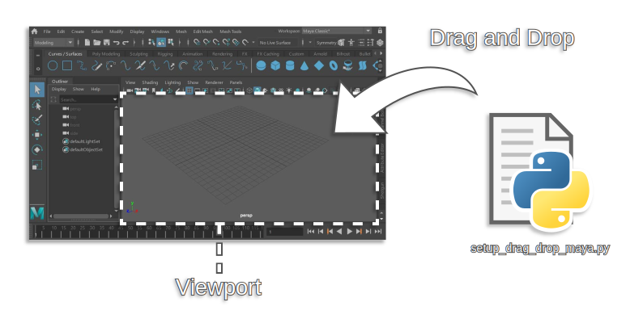

# Contributing to GT-Tools
We highly appreciate your input! We want to make contributing to this project as easy and transparent as possible, whether it's:

- Creating new tools
- Reporting a bug
- Submitting a fix
- Proposing new features
- Becoming a maintainer

## Develop with Github
We use Github to host code, to track issues and feature requests, as well as accept pull requests.

## Use [Github Flow](https://docs.github.com/en/get-started/quickstart/github-flow), So All Code Changes Happen Through Pull Requests
Pull requests are the best way to propose changes to the codebase (we use [Github Flow](https://docs.github.com/en/get-started/quickstart/github-flow)). We actively welcome your pull requests:

1. Fork the repo and create your branch from `dev`.
2. If you've added code that should be tested, add tests.
3. If you've created a new tool, update the documentation.
4. Ensure the test suite passes and add the results to your push request.
5. Issue a pull request!

## Any contributions you make will be under the MIT Software License
In short, when you submit code changes, your submissions are understood to be under the same [MIT License](http://choosealicense.com/licenses/mit/) that covers the project. Feel free to contact the maintainers if that's a concern.

## Report bugs using Github's [issues](https://github.com/TrevisanGMW/gt-tools/issues)
We use GitHub issues to track public bugs. Report a bug by [opening a new issue](https://github.com/TrevisanGMW/gt-tools/issues/new/choose); Your contribution is invaluable to us!

**Great Bug Reports** tend to have:

- A quick summary and/or background
- Steps to reproduce
  - Be specific!
  - Include version used
  - Include system specs
- What you expected would happen
- What actually happens
- Notes (possibly including why you think this might be happening, or stuff you tried that didn't work)

We **love** detailed bug reports!

## Use a Consistent Coding Style

- Functions should have docstrings describing arguments, returns and when possible raises and examples. Use Google Docs pattern for these.
- Make sure to add new utilities to the correct categories.
- 

## License
By contributing, you agree that your contributions will be licensed under its MIT License.