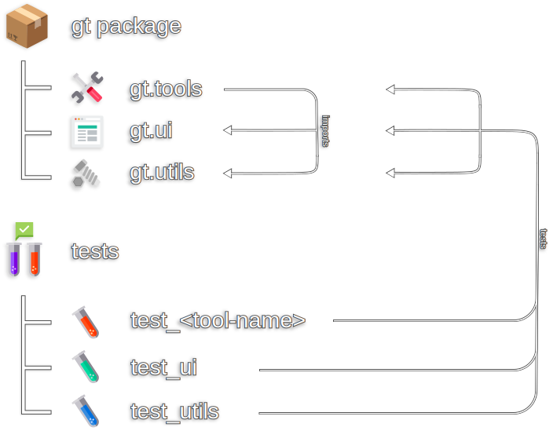

# Contributing to GT-Tools
We highly appreciate your input! We want to make contributing to this project as easy and transparent as possible, whether it's:

- Creating new tools
- Reporting a bug
- Submitting a fix
- Proposing new features
- Becoming a maintainer

## Develop with Github
We use Github to host code, to track issues and feature requests, as well as accept pull requests.

## Use [Github Flow](https://docs.github.com/en/get-started/quickstart/github-flow), So All Code Changes Happen Through Pull Requests
Pull requests are the best way to propose changes to the codebase (we use [Github Flow](https://docs.github.com/en/get-started/quickstart/github-flow)). We actively welcome your pull requests:

1. Fork the repo and create your branch from `dev`.
2. If you've added code that should be tested, add tests.
3. If you've created a new tool, update the documentation.
4. Ensure the test suite passes and add the results to your push request.
5. Issue a pull request!

## Report bugs using Github's [issues](https://github.com/TrevisanGMW/gt-tools/issues)
We use GitHub issues to track public bugs. Report a bug by [opening a new issue](https://github.com/TrevisanGMW/gt-tools/issues/new/choose); Your contribution is invaluable to us!

**Great Bug Reports** tend to have:

- A quick summary and/or background
- Steps to reproduce
  - Be specific!
  - Include version used
  - Include system specs
- What you expected would happen
- What actually happens
- Notes (possibly including why you think this might be happening, or stuff you tried that didn't work)

We **love** detailed bug reports!

## Code Style

- The code style should follow the [PEP8](https://github.com/google/styleguide/blob/gh-pages/pyguide.md#38-comments-and-docstrings) patterns as often as possible.
- Docstring format used is [Google Docs](https://github.com/google/styleguide/blob/gh-pages/pyguide.md#38-comments-and-docstrings). Arguments and returns should be included whenever possible.
- Make sure to add new utilities and user interface functions and classes to the correct script categories.  For example, if it's an animation class/function, add it to "anim_utils.py" so it can be easily found.
- Follow [best practices](https://refactoring.guru/refactoring/smells), such as avoiding bloated code, or minimizing coupling between components.
- Everything should be tested as much as possible.

## Package Structure

1. Tools can import “utils” and “ui” modules and should avoid defining functions that can be shared with other tools. 
2. Tools should not call one another, unless the main purpose of a tool is to interact with other tools.  For instance, a tool that searches, lists or create shortcuts for other tools (this should happen dynamically).
3. The "ui" and "utils" modules should not import any tools.
6. The tests for “test_ui” and “test_utils” have their own directory and should not receive distinct folders for each script.
7. Each tool is tested in a separated directory with the following name pattern: “test_<tool-name>”. e.g. “test_renamer”.
8. All new test modules should be added to the tests “__init__.py” so they participate in the "run all tests" function.

## License
By contributing, you agree that your contributions will be licensed under its  [MIT License](http://choosealicense.com/licenses/mit/).